1.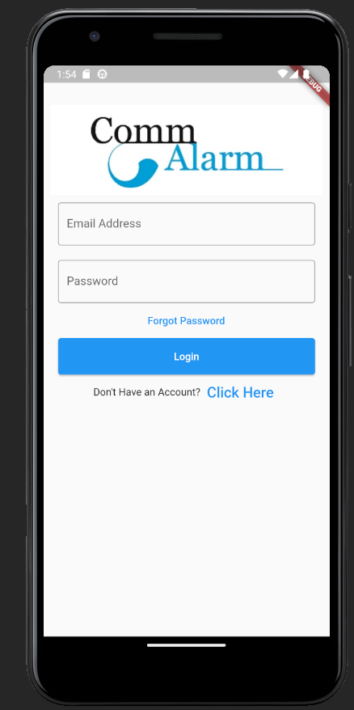

*Landing Page/Login Screen at That has Functional Options to Reset Password and Create New Account*

2.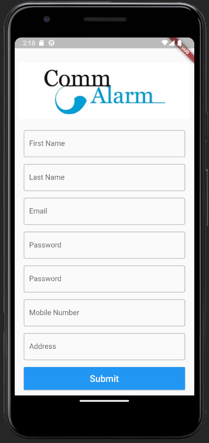

*New User Account Form*

3.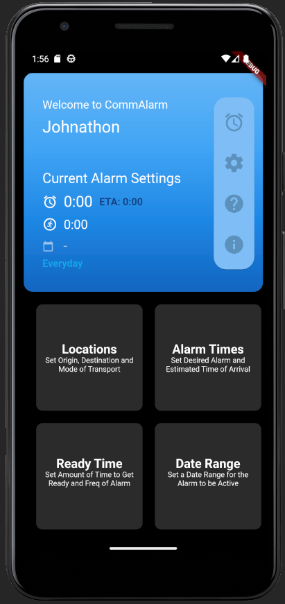

*Dashboard Screen that Welcomes the User w/ Their Name, 
Which is Populated From the User Account Data That is Stored in a SQLite DB*

4. 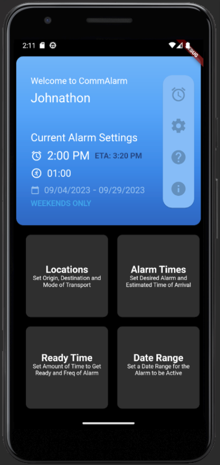
   
*Dashboard Screen With User Selected Data*

5. 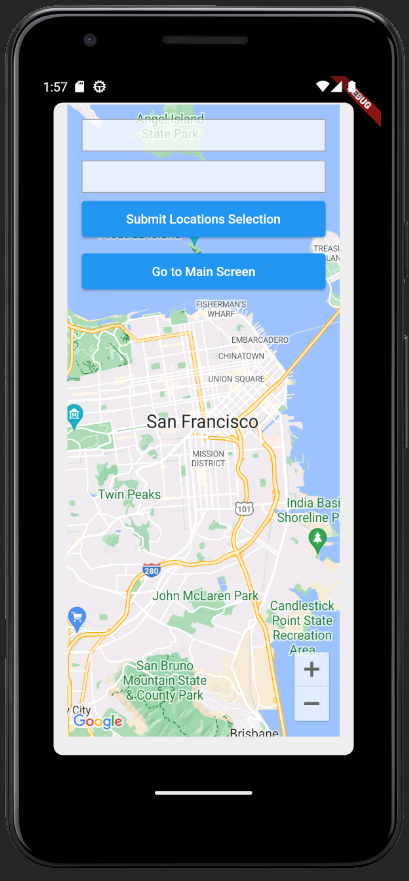
   
*Secondary Screen for User to Enter in Origin and Destination Locations, 
The Map is Generated from Google Maps Direction and Distance API's* 

8. 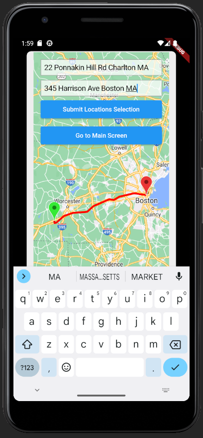
*Same Secondary Location Screen w/ Route Drawn on the Map, 
This was Done Using the GoogleMapController, _polylineCoordinates, and _polylinePoints within the Dart Code*
9. 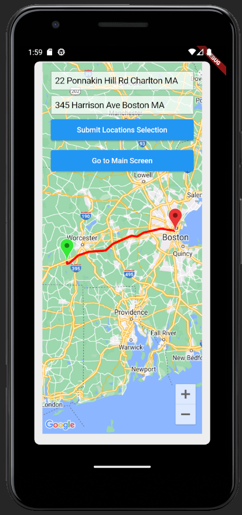
*Same Secondary Location Screen w/ Route Drawn on the Map, but w/o the Phones Keypad*
10. 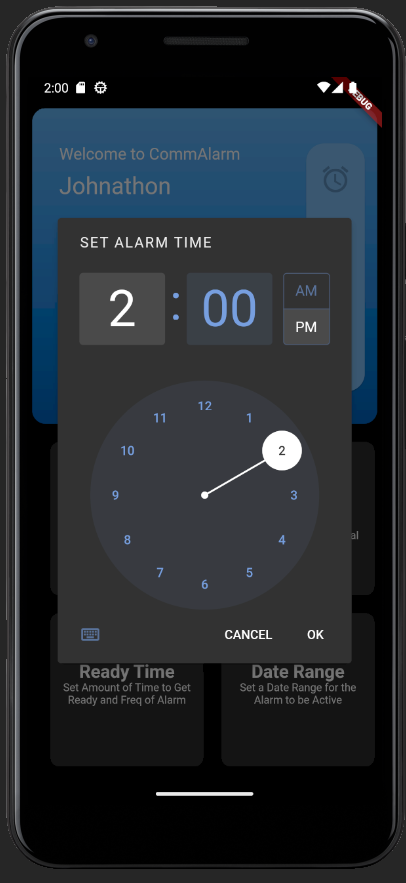
*Popup Window to Allow User to Select Alarm Time, When the Click the Alarm Time Selection Button*
11. 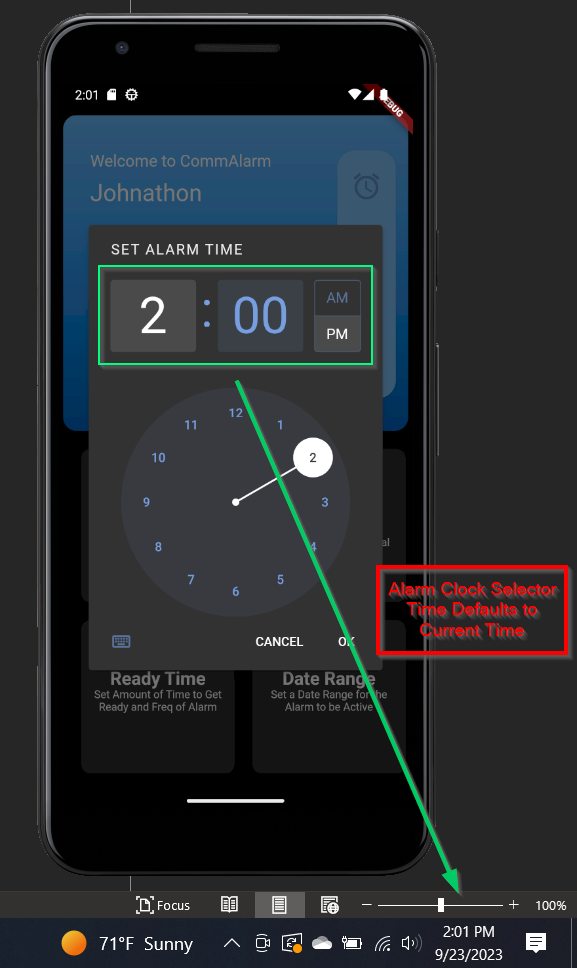
*Another View of Alarm Time Selection Popup Window, 
But Showing That the Initial Alarm Time is Defaulted to Current Time*
12. 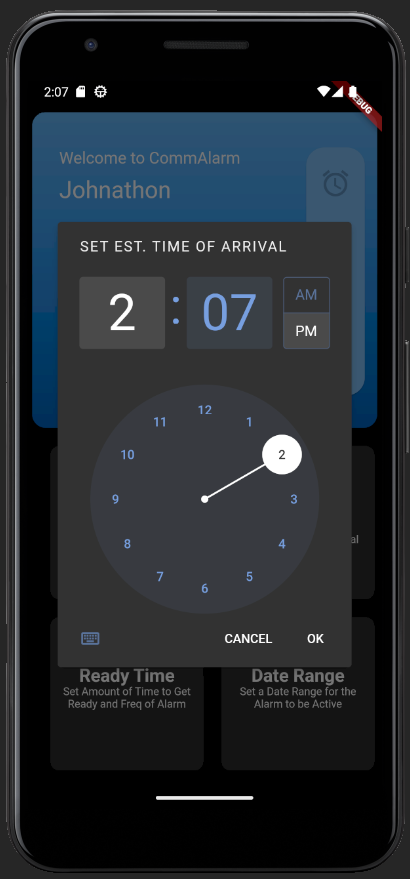
*Popup Window That Automatically Navigates the User to, 
When They Click the "OK" Button on the Alarm Time Selection Window* 
13. 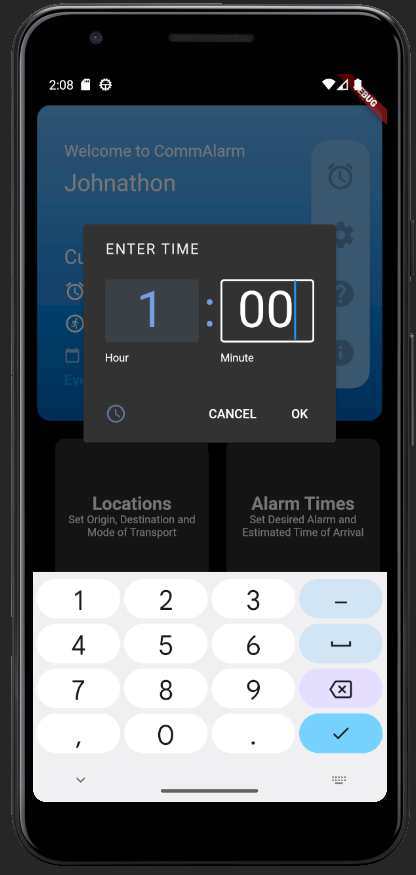
*Popup Window to Allow User to Select Amount of Time the User Estimates How Long it Takes Them to Get Ready, 
When the Click the Ready Time Selection Button*
14. 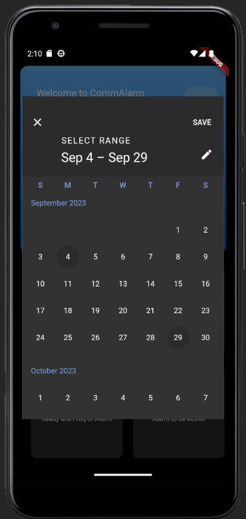
**Popup Window to Allow User to Select Either a Single Date or a Range of Dates, 
That They Would Like to Have the Alarm Set to*

# commalarm_app

A new Flutter project.

## Getting Started

This project is a starting point for a Flutter application.

A few resources to get you started if this is your first Flutter project:

- [Lab: Write your first Flutter app](https://docs.flutter.dev/get-started/codelab)
- [Cookbook: Useful Flutter samples](https://docs.flutter.dev/cookbook)

For help getting started with Flutter development, view the
[online documentation](https://docs.flutter.dev/), which offers tutorials,
samples, guidance on mobile development, and a full API reference.
